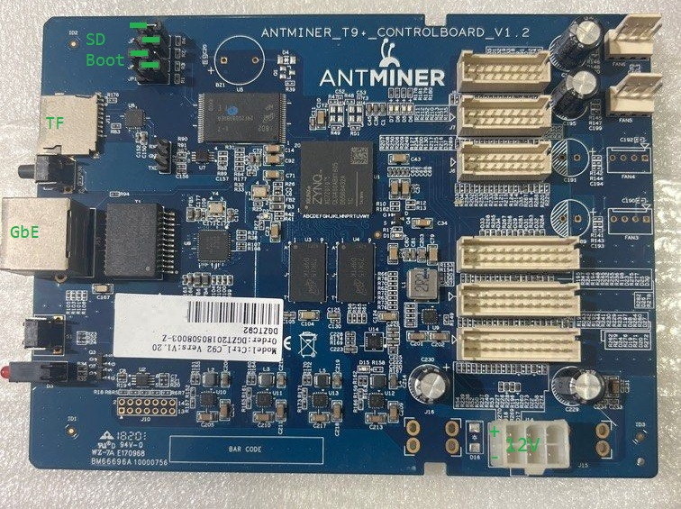

# Antminer T9 controller as ZYNQ devboard


# Quick start
- Download PYNQ Z1 offical SD image `http://www.pynq.io/boards.html`
- Use Raspberry Pi Imager to write the SD image into a TF Card
- Copy everything inside `boot/` folder into the 1st partition of the TF Card (overwrite files with same name)
- Remove image.ub from the TF Card
- Plug the TF Card into antminer T9
- Set jumper JP4=1, JP3=0, JP2=1, JP1=0. 1=Left, 0=Right.
- Power the board with 12V 1A DC supply
- Connect ethernet cable, following PYNQ offical guide.

Notes:
- It's Ubuntu 22.04 inside, with gcc, jupyter and numpy preinstalled.
- Bootup takes about 30secs, ethernet is DHCP.
- SSH and jupyter access: url=http://pynq.local/ username=xilinx, password=xilinx.

# Vivado quick config
- CPU XC7Z010-1CLG400C
- PS-PL, Non Secure Enablement, M AXI GP0, Disable
- MIO0, MIO2-14 NAND FLASH
- MIO16\~27 MIO52\~53 ENET0+MDIO, PHY ADDR=1
- MIO40\~45 SD0
- MIO48\~49 UART1
- DDR MT41K128M16JT-125:K (D9PTK) 32Bit, No ECC
- Interrupts Enable

# Ethernet PHY
Broadcom B50612D PHYA[0]=1 TEST2/3=00 -> PHYAddr=1, `reg = <1>`

# FPGA clocks
Y2 TCXO -> R49 -> L12P 34 K17
Y3 TCXO -> R51 -> L13P 34 H16

# Boot jumper
BOOT JP1~4 -> BOOT[3:0]
     LEFT=1, RIGHT=0
     0100 -> NAND
     0101 -> SD1      

# LED and button
D1 GREEN FPGA_DONE
D2 GREEN MIO15
D3 RED   MIO37
   GREEN MIO38

S1 RESET
S2 MIO51

LED7 L6P 35 F16
LED8 L9P 35 L19
LED5 L7P 35 M19
LED6 L8P 35 M17

# User I/O
```
FANX PIN3 PIN4
FAN6 L17N L14P
     34   34
     H20  J18
FAN5 L16P L14P
     34   34
     G17  J18
FAN4 L17P L14P
     34   34
     J20  J18
FAN3 L15N L14P
     34   34
     F20  J18
```

```
J8
1    3    5    7    9    11   13   15   17
2    4    6    8    10   12   14   16   18
GND  L22N L17P H    GND  L18P GND  L17N x
     34   34             34        34
     W19  Y18            V16       Y19
GND  L22P H    H    GND  L18N GND  VCC  x
     34                  34
     W18                 W16

J7 BANK34
1    3    5    7    9    11   13   15   17
2    4    6    8    10   12   14   16   18
GND  L22N L15P H    GND  L16P GND  L15N x
     34   34             34        34
     W19  T20            V20       U20
GND  L22P H    H    GND  L16N GND  VCC  x
     34                  34
     W18                 W20

J6 BANK34
1    3    5    7    9    11   13   15   17
2    4    6    8    10   12   14   16   18
GND  L22N L11P H    GND  L12P GND  L11N x
     34   34             34        34
     W19  U14            U18       U15
GND  L22P H    H    GND  L12N GND  VCC  x
     34                  34
     W18                 U19

J4
1    3    5    7    9    11   13   15   17   19   21   23
2    4    6    8    10   12   14   16   18   20   22   24
GND  L21N L7P  L3P  GND  L8P  GND  L7N  L2P  GND  L24P GND
     34   34   35        34        34   35        35
     V18  Y16  E17       W14       Y17  B19       K16
GND  L21P L9P  L3N  GND  L8N  GND  VCC  L2N  GND  L24N GND
     34   34   35        34             35        35
     V17  T16  D18       Y14            B20       J16

J3
1    3    5    7    9    11   13   15   17   19   21   23
2    4    6    8    10   12   14   16   18   20   22   24
GND  L24N L5P  L1P  GND  L6P  GND  L5N  L20P GND  L23P GND
     34   34   35        34        34   34        35
     P16  T14  C20       P14       T15  T17       M14
GND  L24P L1N  L1N  GND  L6N  GND  VCC  L20N GND  L23N GND
     34   34   35        34             34        35
     P15  T10  B20       R14            R18       M15

J2
1    3    5    7    9    11   13   15   17   19   21   23
2    4    6    8    10   12   14   16   18   20   22   24
GND  L23N L9P  L10P GND  L4P  GND  L3N  L2P  GND  L22P GND
     34   34   35        34        34   34        35
     P18  U17  V15       V12       V13  T12       L14
GND  L23P L1P  L10N GND  L4N  GND  VCC  L2N  GND  L22N GND
     34   34   35        34             34        35
     N17  T11  W15       W13            U12       L15
```
